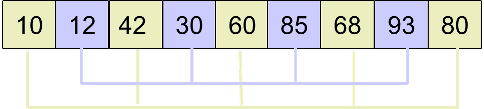

# 常见排序算法

*提要 本篇讨论七种排序算法基本原理和实例过程，书写代码，分析特点和适用场景。*

## 冒泡排序(Bubble Sort)

冒泡排序(Bubble Sort)是一种简单的排序算法。它重复地走访要排序的数列，一次比较两个元素，如果他们的顺序错误就把他们交换过来。走访数列重复进行下去直到没有再需要交换，此时数列已经排序完成。算法的名字由来是因为越小的元素会经由交换慢慢浮到数列顶端。

算法的流程如下

1. 比较相邻的元素。如果第一个比第二个大就交换它们两个。

2. 对每一对相邻元素执行同样的工作，从开始到一对到结尾最后一对，此时最后一个元素是最大的。

3. 针对所有的元素重复以上步骤，除了最后一个元素。

4. 持续每次对越来越少的元素重复上述步骤，直到没有数字需要比较为止。

算法的示意图如下

### 实例分析

以数组arr = [5, 1, 4, 2, 8]为例说明，每次比较的两个数字加粗显示

第一次外循环

(**5**, **1**, 4, 2, 8) -> (**1**, **5**, 4, 2, 8)    5 > 1 交换位置

(1, **5**, **4**, 2, 8) -> (1, **4**, **5**, 2, 8)    5 > 4 交换位置

(1, 4, **5**, **2**, 8) -> (1, 4, **2**, **5**, 8)    5 > 2 交换位置

(1, 4, 2, **5**, **8**) -> (1, 4, 2, **5**, **8**)    5 < 8 位置不变

第二次外循环

(**1**, **4**, 2, 5, 8) -> (**1**, **4**, 2, 5, 8)    1 < 4 位置不变

(1, **4**, **2**, 5, 8) -> (1, **2**, **4**, 5, 8)    4 > 2 交换位置

(1, 2, **4**, **5**, 8) -> (1, 2, **4**, **5**, 8)    4 < 5 位置不变

第三次外循环(可以注意到这里的数组排序已经完成，但是程序还要继续循环)

(**1**, **2**, 4, 5, 8) -> (**1**, **2**, 4, 5, 8)         

(1, **2**, **4**, 5, 8) -> (1, **2**, **4**, 5, 8)

第四次外循环

(**1**, **2**, 4, 5, 8) -> (**1**, **2**, 4, 5, 8)

### JavaScript语言实现

    function bubbleSort(array) {
        var length = array.length,
        i,
        j,
        temp;
        for (i = length - 1; 0 < i; i--) {
            for (j = 0; j < i; j++) {
                if (array[j] > array[j + 1]) {
                    temp = array[j];
                    array[j] = array[j + 1];
                    array[j + 1] = temp;
                }
            }
        }
        return array;
    }

## 选择排序(Selection Sort)

选择排序(Selection Sort)是一种简单直观的排序算法。它的工作原理如下：首先在未排序序列中找到最小(大)元素，存放到排序序列的起始位置，然后，再从剩余未排序序列元素中继续寻找最小的(大)元素，然后放到已排序序列末尾。以此类推，直到所有元素均排序完毕。

选择排序的主要优点与数据移动有关，如果某个元素位于正确的最终位置上，则它不会被移动。选择排序每次交换一对元素，它们当中至少有一个将被移动到最终位置上，因此对n个元素的序列进行排序总共进行至多n-1次交换。在所有的完全依靠交换去移动的排序方法中，选择排序属于非常好的一种。

算法示意图如下

### 实例分析

以数组arr = [8, 5, 2, 6, 9, 3, 1, 4, 0, 7]为例，直观介绍下每一步的操作。

第一次从数组[8, 5, 2, 6, 9, 3, 1, 4, 0, 7]中找到最小的数0，放到数组第一个位置

[8, 5, 2, 6, 9, 3, 1, 4, 0, 7]
                         ↑
                        min

交换后

[0, 5, 2, 6, 9, 3, 1, 4, 8, 7]

第二次在剩余序列[5, 2, 6, 9, 3, 1, 4, 0, 7]中找到最小的数1，放到数组第二个位置

[0, 5, 2, 6, 9, 3, 1, 4, 8, 7]
                   ↑
                  min

交换后

[0, 1, 2, 6, 9, 3, 5, 4, 8, 7]

第三次在剩余序列[2, 6, 9, 3, 5, 4, 8, 7]中找到最小的数2，放到数组第三个位置(实际不需要交换)

[0, 1, 2, 6, 9, 3, 5, 4, 8, 7]
       ↑
      min

交换后

[0, 1, 2, 6, 9, 3, 5, 4, 8, 7]

重复上述过程，直到最后一个元素完成排序。

### JavaScript语言实现

    function selectionSort(array) {
        var length = array.length,
        i,
        j,
        minIndex,
        minValue,
        temp;
        for (i = 0; i < length - 1; i++) {
            minIndex = i;
            minValue = array[minIndex];
            for (j = i + 1; j < length; j++) {
                if (array[j] < minValue) {
                    minIndex = j;
                    minValue = array[minIndex];
                }
            }
            // 交换位置
            temp = array[i];
            array[i] = minValue;
            array[minIndex] = temp;
        }
        return array
    }

## 插入排序(Insertion Sort)

设有一组关键字{K1, K2, ..., Kn}，排序开始认为K1是一个有序序列，让K2插入上述表长为1的有序序列，使之成为一个表长为2的有序序列，然后让K3插入上述表长为2的有序序列，使之成为一个表长为3的有序序列;依此类推，最后让Kn插入上述表长为n-1的有序序列，得一个表长为n的有序序列。

具体算法描述如下:

1. 从第一个元素开始，该元素可以认为已经被排序

2. 取出下一个元素，在已经排序的元素序列中从后向前扫描

3. 如果该元素(已排序)大于新元素，将该元素移到下一位置

4. 重复步骤3，直到找到已排序的元素小于或者等于新元素的位置

5. 将新元素插入到该位置后

6. 重复步骤2 ~ 5

如果比较操作的代价比交换操作大的话可以使用二分查找法来减少比较操作的数量。

在每次比较操作发现新元素小于或等于已排序元素时，可以将已排序的元素移到下一个位置，然后再将新元素插入该位置，接着再与前面的元素进行比较，这样做交换操作代价比较大。

建议的做法是将新元素取出，从左到右依次与已排序的元素比较，直到找到已排序的元素小于等于新元素的位置，这时再将新元素插入进去，操作步骤如下：

算法示意图如下：

### 实例分析

现有一数组arr = [5, 6, 3, 1, 8, 7, 2, 4]，排序过程如下

[5]  6  3  1  8  7  2  4

[5, 6]  3  1  8  7  2  4

[3, 5, 6]  1  8  7  2  4

[1, 3, 5, 6]  8  7  2  4

[1, 3, 5, 6, 8]  7  2  4

[1, 3, 5, 6, 7, 8]  2  4

[1, 2, 3, 5, 6, 7, 8]  4

[1, 2, 3, 4, 5, 6, 7, 8]

### JavaScript语言实现

    function insertionSort(array) {
        function swap(array, i, j) {
            var temp = array[i];
            array[i] = array[j];
            array[j] = temp;
        }
        var length = array.length,
        i,
        j;
        for (i = 1; i < length; i++) {
            for (j = i; j > 0; j--) {
                if (array[j - 1] > array[j]) {
                    swap(array, j - 1, j);
                } else {
                    break;
                }
            }
        }
        return array;
    }

    //交换次数优化
    function insertionSort(array) {
        var length = array.length,
        i,
        j,
        temp;
        for (i = 1; i < length; i++) {
            temp = array[i];
            for (j = i; j >= 0; j--) {
                if (array[j - 1] > temp) {
                    array[j] = array[j - 1];
                } else {
                    array[j] = temp;
                    break;
                }
            }
        }
        return array;
    }

    //比较次数优化
    function insertionSort2(array) {
        function binarySearch(array, start, end, temp) {
            var middle;
            while (start <= end) {
                middle = Math.floor((start + end) / 2);
                if (array[middle] < temp) {
                    if (temp <= array[middle + 1]) {
                        return middle + 1;
                    } else {
                        start = middle + 1;
                    }
                } else {
                    if (end === 0) {
                        return 0;
                    } else {
                        end = middle;
                    }
                }
            }
        }
        function binarySort(array) {
            var length = array.length,
                i,
                j,
                k,
                temp;
            for (i = 1; i < length; i++) {
                temp = array[i];
                if (array[i - 1] <= temp) {
                    k = i;
                } else {
                    k = binarySearch(array, 0, i - 1, temp);
                    for (j = i; j > k; j--) {
                        array[j] = array[j - 1];
                    }
                }
                array[k] = temp;
             }
             return array;
        }
        return binarySort(array);
    }

## 希尔排序(Shell Sort)

希尔排序算法是按其设计者希尔(Donald)的名字命名的，该算法由1959年公布，是插入排序的一种更高效的改进版本。它的做法不是每次一个元素挨一个元素的比较。而是初期选用大跨步(增量较大)间隔比较，使记录跳跃式接近它的排序位置，然后增量减小，最后增量为1，这样记录移动次数大大减小，提高了排序效率。希尔排序对增量序列选择没有严格规定。

希尔排序是基于插入排序的以下两点性质而提出改进方法的：

- 插入排序在对几乎已经排好序的数据操作时，效率高，即可以达到线性排序的效率

- 插入排序一般来说是比较低效的，因为每次排序只能移动一位

算法思路如下：

1. 先取一个正整数d1(d1 < n)，把全部记录分成d1个组，所有距离为d1倍数的记录看成一组，然后在各组内进行插入排序

2. 然后取d2(d2 < d1)

3. 重复上述分组和排序操作，直到取di = 1(i >= 1)位置，即所有记录成为一个组，最后对这个组进行插入排序。一般d1约为n/2，d2为d1/2，d3为d2/2，...，di = 1

算法示意图如下：

### 实例分析

假设有数组arr = [80, 93, 60, 12, 42, 30, 68, 85, 10]，首先取d1 = 4，将数组分为4组

然后分别对4个小组进行插入排序，排序后结果为

然后取d2 = 2，将原数组分为2个小组

然后分别对2个小组进行插入排序，排序后结果为

最后取d3 = 1，进行插入排序得到最终结果

### JavaScript语言实现

    function shellSort(array) {
        function swap(array, i, k) {
            var temp = array[i];
            array[i] = array[k];
            array[k] = temp;
        }
        var length = array.length,
        gap = Math.floor(length / 2);
        while (gap > 0) {
            for (var i = gap; i < length; i++) {
                for (var j = i; 0 < j; j -= gap) {
                    if (array[j - gap] > array[j]) {
                        swap(array, j - gap, j);
                    } else {
                        break;
                    }
                }
            }
            gap = Math.floor(gap / 2);
        }
        return array;
    }

## 快速排序(Quick Sort)

快速排序是图灵奖得主 C. R. A. Hoare 于 1960 年提出的一种划分交换排序。它采用了一种分治的策略，通常称其为分治法(Divide-and-ConquerMethod)。

分治法的基本思想是：将原问题分解为若干个规模更小但结构与原问题相似的子问题。递归地解决这些子问题，然后将这些子问题的解组合成为原问题的解。

利用分治法可将快速排序分为三步：

1. 在数据集之中，选择一个元素作为"基准"(pivot)

2. 所有小于"基准"的元素，都移动到"基准"的左边，所有大于"基准"的元素，都移到"基准"的右边。这个操作称为分区(partition)操作，分区操作结束后，基准元素所处的位置就是最终排序后它的位置。

3. 对"基准"左边和右边的两个子集，不断重复第一步和第二步，直到所有子集只剩下一个元素为止。

算法示意图如下：

分区是快速排序的主要内容，伪代码如下

    function partition(a, left, right, pivotIndex)
        pivotValue := a[pivotIndex]
        swap(a[pivotIndex], a[right]) // 把 pivot 移到結尾
        storeIndex := left
        for i from left to right-1
            if a[i] < pivotValue
                swap(a[storeIndex], a[i])
                storeIndex := storeIndex + 1
            swap(a[right], a[storeIndex]) // 把 pivot 移到它最後的地方
            return storeIndex // 返回 pivot 的最终位置

首先，把基准元素移到結尾（如果直接选择最后一个元素为基准元素，那就不用移动），然后从左到右（除了最后的基准元素），循环移动小于等于基准元素的元素到数组的开头，每次移动 storeIndex 自增 1，表示下一个小于基准元素将要移动到的位置。循环结束后 storeIndex 所代表的的位置就是基准元素的所有摆放的位置。所以最后将基准元素所在位置（这里是 right）与 storeIndex 所代表的的位置的元素交换位置。要注意的是，一个元素在到达它的最后位置前，可能会被交换很多次。

一旦我们有了这个分区算法，要写快速排列本身就很容易：

    procedure quicksort(a, left, right)
        if right > left
            select a pivot value a[pivotIndex]
            pivotNewIndex := partition(a, left, right, pivotIndex)
            quicksort(a, left, pivotNewIndex-1)
            quicksort(a, pivotNewIndex+1, right)

### 实例分析

以数组arr = [3, 7, 8, 5, 2, 1, 9, 5, 4]，分区可以分解为以下步骤

首先选定一个基准元素，这里我们以元素5为基准元素(基准元素可以任意选择)

       pivot
         ↓
3  7  8  5  2  1  9  5  4

将基准元素与数组中最后一个元素交换位置，如果选择最后一个元素为基准元素可省略该步骤

                      pivot
                        ↓
3  7  8  4  2  1  9  5  5

从左到右(除了最后的基准元素)，循环移动小于基准元素5的所有元素到数组开头，留下大于等于基准元素接在后面。这个过程也为基准元素寻找最后摆放的位置

循环i == 0，storeIndex == 0，找到一个小于基准元素的元素3，那么将其与storeIndex所在位置的元素交换位置，这里是3自身，交换后storeIndex自增1，storeIndex==1                      

                             pivot
                               ↓         
       3  7  8  4  2  1  9  5  5
       ↑
   storeIndex

循环i == 3，storeIndex == 1，找到一个小于基准元素的元素4

                             pivot
          ↓     ↓              ↓
       3  7  8  4  2  1  9  5  5
          ↑     ↑
      storeIndex

交换位置后，storeIndex自增1，storeIndex == 2

                             pivot
                               ↓
       3  4  8  7  2  1  9  5  5
             ↑
        storeIndex   

循环i == 4，storeIndex == 2，找到一个小于基准元素的元素2

                             pivot
             ↓     ↓           ↓
       3  4  8  7  2  1  9  5  5
             ↑     ↑           
        storeIndex

交换位置后，storeIndex自增1，storeIndex == 3

                             pivot
                               ↓
       3  4  2  7  8  1  9  5  5  
                ↑
            storeIndex

循环i == 5，storeIndex == 3，找到一个小于基准元素的元素1

                             pivot
                ↓     ↓        ↓
       3  4  2  7  8  1  9  5  5
                ↑     ↑
            storeIndex

交换位置后，storeIndex自增1，storeIndex == 4

                             pivot
                               ↓
       3  4  2  1  8  7  9  5  5
                   ↑       
               storeIndex

循环i == 7，storeIndex == 4，找到一个小于等于基准元素的元素5

                             pivot
                   ↓        ↓  ↓
       3  4  2  1  8  7  9  5  5
                   ↑        ↑   
              storeIndex

交换位置后，storeIndex自增1，storeIndex == 5

                             pivot
                               ↓
       3  4  2  1  5  7  9  5  5
                      ↑
                 storeIndex

循环结束后交换基准元素和storeIndex位置元素

       3  4  2  1  5  5  9  8  7

那么storeIndex的值就是基准元素的最终位置，这样整个分区过程就完成了。

### JavaScript语言实现

    function quickSort(array) {
        // 交换元素位置
        function swap(array, i, k) {
            var temp = array[i];
            array[i] = array[k];
            array[k] = temp;
        }
        // 数组分区，左小右大
        function partition(array, left, right) {
            var storeIndex = left;        
            var pivot = array[right]; // 直接选最右边的元素为基准元素
            for (var i = left; i < right; i++) {
                if (array[i] < pivot) {
                    swap(array, storeIndex, i);
                    storeIndex++; // 交换位置后，storeIndex 自增 1，代表下一个可能要交换的位置
                }
            }
            swap(array, right, storeIndex); // 将基准元素放置到最后的正确位置上
            return storeIndex;
        }
        function sort(array, left, right) {
            if (left > right) {
                return;
            }
            var storeIndex = partition(array, left, right);
            sort(array, left, storeIndex - 1);
            sort(array, storeIndex + 1, right);
        }
        sort(array, 0, array.length - 1);
        return array;
    }

## 归并排序(Merge Sort)

归并排序(Merge Sort)是建立在归并操作上的一种有效的排序算法。该算法是采用分治法的一个非常典型应用。

归并操作指的是将两个已经排序的序列合并成一个序列的操作。归并排序算法依赖归并操作。归并排序有多路归并排序，两路归并排序，可用于内排序，也可用于外排序。这里仅对内排序的两路归并方法进行讨论。

算法思路

1. 把n个记录看成n个长度为1的有序子表

2. 进行两两归并使记录关键字有序，得到n/2个长度为2的有序子表

3. 重复第2步直到所有记录归并成一个长度为n的有序表为止。

算法示意图如下

### 实例分析

以数组 arr = [6, 5, 3, 1, 8, 7, 2, 4]为例演示归并排序的步骤

首先将数组分为长度为2的子数组，并使每个子数组有序

[6, 5]  [3, 1]  [8, 7]  [2, 4]

[5, 6]  [1, 3]  [7, 8]  [2, 4]

然后两两合并

[6, 5, 3, 1]   [8, 7, 2, 4]

[1, 3, 5, 6]   [2, 4, 7, 8]

最后将两个子数组合并

[1, 3, 5, 6]   [2, 4, 7, 8]

[1, 2, 3, 4, 5, 6, 7, 8]

归并流程也可以如下表示

### JavaScript语言实现

由于插入排序在几乎已经排序好的数组中效率高，可以达到线性效率，所以我们可以将其中一个数组中的元素依次插入到另一个数组当中，使其归并后成为一个有序的数组。代码如下：

    function mergeSort(array) {
        function sort(array, first, last) {
            first = (first === undefined) ? 0 : first
            last = (last === undefined) ? array.length - 1 : last
            if (last - first < 1) {
               return;
            }
            var middle = Math.floor((first + last) / 2);
            sort(array, first, middle);
            sort(array, middle + 1, last);
            var f = first,
                m = middle,
                i,
                temp;
            while (f <= m && m + 1 <= last) {
                if (array[f] >= array[m + 1]) { // 这里使用了插入排序的思想
                    temp = array[m + 1];
                    for (i = m; i >= f; i--) {
                        array[i + 1] = array[i];
                    }
                    array[f] = temp;
                    m++
                } else {
                    f++
                }
            }
            return array;
        }
        return sort(array);
    }
