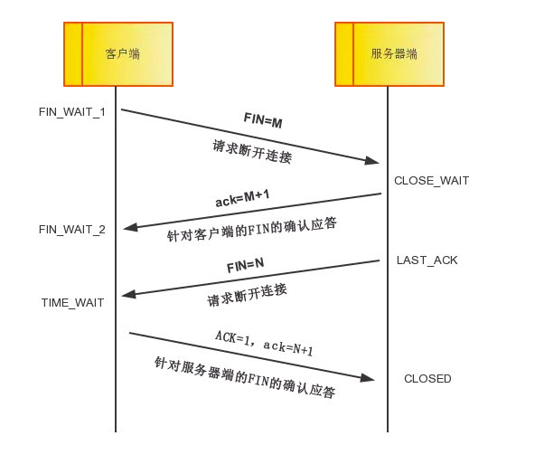
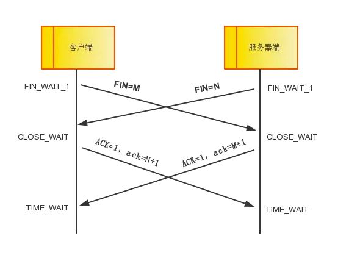

# TCP三次握手与四次挥手

## TCP三次握手

- TCP提供面向有连接的通信传输。面向有连接是指在数据通信开始之前先做好两端之间的准备工作。

- 所谓三次握手是指建立一个TCP连接时需要客户端和服务端总共发送三个包以确认连接的建立。在socket编程中，这一过程由客户端执行connect来触发。

### 三次握手的流程图

### 三次握手过程描述

- 第一次握手：客户端将标志位SYN置为1，随机产生一个值seq=J，并将该数据包发送给服务器端，客户端进入SYN_SENT状态，等待服务器端确认。

- 第二次握手：服务器端收到数据包后由标志位SYN=1知道客户端请求建立连接，服务器端将标志位SYN和ACK都置为1，ack=J+1，随机产生一个值seq=K，并将该数据包发送给客户端以确认连接请求，服务器端进入SYN_RCVD状态。

- 第三次握手：客户端收到确认后，检查ack是否为J+1，ACK是否为1，如果正确则将标志位ACK置为1，ack=K+1，并将该数据包发送给服务器端，服务器端检查ack是否为K+1，ACK是否为1，如果正确则连接建立成功，客户端和服务器端进入ESTABLISHED状态，完成三次握手，随后客户端与服务器端之间可以开始传输数据了。

## TCP四次挥手

- 四次挥手即终止TCP连接，就是指断开一个TCP连接时，需要客户端和服务端总共发送4个包以确认连接的断开。在socket编程中，这一过程由客户端或服务端任一方执行close来触发。

- 由于TCP连接是全双工的，因此，每个方向都必须要单独进行关闭，这一原则是当一方完成数据发送任务后，发送一个FIN来终止这一方向的连接，收到一个FIN只是意味着这一方向上没有数据流动了，即不会再收到数据了，但是在这个TCP连接上仍然能够发送数据，直到这一方向也发送了FIN。首先进行关闭的一方将执行主动关闭，而另一方则执行被动关闭。

### 四次挥手示意图

一方主动一方被动的情况：

同时发起主动关闭的情况：

### 四次挥手过程描述

- 中断连接端可以是客户端，也可以是服务器端。

- 第一次挥手：客户端发送一个FIN=M，用来关闭客户端到服务器端的数据传送，客户端进入FIN_WAIT_1状态。意思是说"我客户端没有数据要发给你了"，但是如果你服务器端还有数据没有发送完成，则不必急着关闭连接，可以继续发送数据。

- 第二次挥手：服务器端收到FIN后，先发送ack=M+1，告诉客户端，你的请求我收到了，但是我还没准备好，请继续你等我的消息。这个时候客户端就进入FIN_WAIT_2 状态，继续等待服务器端的FIN报文。

- 第三次挥手：当服务器端确定数据已发送完成，则向客户端发送FIN=N报文，告诉客户端，好了，我这边数据发完了，准备好关闭连接了。服务器端进入LAST_ACK状态。

- 第四次挥手：客户端收到FIN=N报文后，就知道可以关闭连接了，但是他还是不相信网络，怕服务器端不知道要关闭，所以发送ack=N+1后进入TIME_WAIT状态，如果Server端没有收到ACK则可以重传。服务器端收到ACK后，就知道可以断开连接了。客户端等待了2MSL后依然没有收到回复，则证明服务器端已正常关闭，那好，我客户端也可以关闭连接了。最终完成了四次握手。

## 相关问题讨论

#### 什么是SYN攻击？

在三次握手过程中，服务器发送SYN-ACK之后，收到客户端的ACK之前的TCP连接称为半连接(half-open connect)，此时服务器处于SYN_RECV状态，当收到ACK后，服务器转入ESTABLISHED状态。

SYN攻击就是攻击客户端在短时间内伪造大量不存在的IP地址，向服务器不断发送SYN包，服务器回复确认包，并等待客户的确认，由于源地址是不存在的，服务器需要不断的重发直至超时，这些伪造的SYN包将长时间占用未连接队列，正常的SYN请求被丢弃，目标系统运行缓慢，严重者引起网络堵塞甚至系统瘫痪。

SYN攻击是一个典型的DDOS攻击，检测SYN攻击非常的方便，当你在服务器上看到大量的半连接状态时，特别是源IP地址是随机的，基本上可以断定这是一次SYN攻击，在Linux下可以如下命令检测系统是否被SYN攻击。

    netstat -n TCP|grep SYN_RECV

一般较新的TCP/IP协议栈都对这一过程进行修正来防范SYN攻击，修改TCP协议实现，主要方法有SynAttackProtect保护机制，SYN cookie技术，增加最大半连接和缩短超时时间等。但是不能完全防范syn攻击。

#### 为什么建立连接是三次握手，关闭连接是四次握手？

这是因为服务端的LISTEN状态下的SOCKET当收到SYN报文的建立连接请求后，它可以把ACK和SYN(SYN起同步作用，ACK起应答作用)放在一个报文里来发送。但关闭连接时，当收到对方的FIN报文通知时，它仅仅表示对方没有数据发送给你了，但未必你所有的数据都全部发送给对方了，所以你可能未必马上关闭SOCKET，也即你可能还需要发送一些数据给对方后，再发送FIN报文给对方
来表示你同意现在可以关闭连接了，所以它这里的ACK报文和FIN报文多数情况是分开发送的。

#### 为什么TIME_WAIT状态还需要等2MSL后才能返回到CLOSED状态？

这是因为虽然双方都同意关闭连接了，而且握手的四个报文也都协调发送和发送完毕，按理可以直接回到CLOSED状态(就好比SYN_SEND状态到ESTABLISH状态那样)，但是因为我们必须要假想网络是不可靠的，你无法保证你最后发送的ACK报文一定被对方收到，因此对方处于LAST_ACK状态下的SOCKET可能因为超时未收到ACK报文，而重发FIN报文，所以这个TIME_WAIT状态的作用就是用来重发可能丢失的ACK报文。
